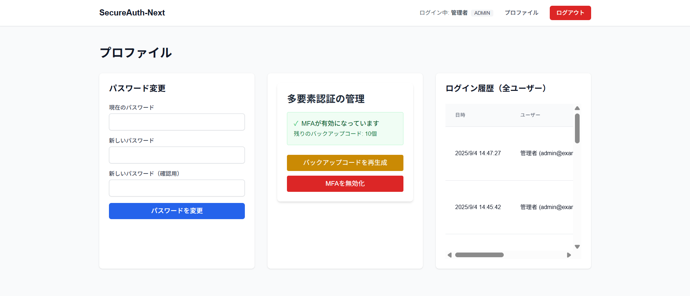
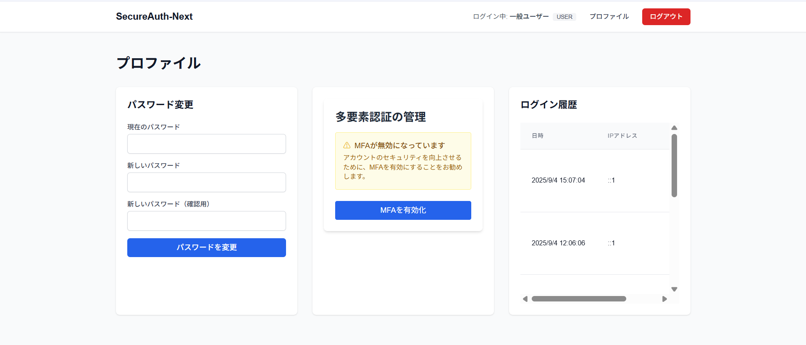

# SecureAuth-Next

セキュアな認証・認可機能を持つNext.jsアプリケーション

## アプリケーション概要

SecureAuth-Nextは、現代的なWebアプリケーションに求められるセキュアな認証・認可機能を実装したNext.jsアプリケーションです。JWT（JSON Web Token）ベースの認証システムを採用し、セキュリティを重視した設計となっています。

### 実装された認証機能

- **JWTトークンベース認証**: CookieベースのJWT認証
- **パスワードハッシュ化**: bcryptによる安全なパスワード保存
- **アカウントロック機能**: ブルートフォース攻撃対策
- **パスワード強度チェック**: リアルタイムパスワード強度評価
- **ログイン履歴管理**: セキュリティ監査のための履歴記録
- **Content Security Policy**: 厳格なセキュリティヘッダー設定
- **ワンタイムパスワード（MFA）**: TOTPベースの多要素認証


### 1. JWTトークンベース認証

**実装ファイル**: `src/lib/jwt.ts`

JWT認証システムは、セキュアなCookieベースのトークン管理を採用しています。

**主要な実装内容**:

```typescript
// JWTペイロードの型定義
export interface JWTPayload {
  sub: string // user id
  role: string
  iat: number
  exp: number
}

// JWTトークンの生成（3時間有効）
export async function createJWT(payload: Omit<JWTPayload, 'iat' | 'exp'>) {
  const jwt = await new SignJWT(payload)
    .setProtectedHeader({ alg: 'HS256' })
    .setIssuedAt()
    .setExpirationTime('3h')
    .sign(secret)
  return jwt
}

// セキュアなCookie設定
export function setJWTCookie(token: string) {
  const cookieStore = cookies()
  cookieStore.set('auth-token', token, {
    httpOnly: true,           // XSS対策
    secure: process.env.NODE_ENV === 'production', // HTTPS必須
    sameSite: 'strict',       // CSRF対策
    path: '/',
    maxAge: 3 * 60 * 60       // 3時間
  })
}
```

**認証フロー**:
1. ログイン成功時にJWTトークンを生成
2. HttpOnly Cookieとして保存（JavaScriptからアクセス不可）
3. ミドルウェアで保護されたルートへのアクセス時に検証
4. トークン期限切れ時は自動的にログインページにリダイレクト

**セキュリティ対策**:
- **HttpOnly**: XSS攻撃によるトークン窃取を防止
- **Secure**: HTTPS通信時のみCookie送信
- **SameSite=Strict**: CSRF攻撃を防止
- **3時間の有効期限**: トークンの有効期間を制限

### 2. アカウントロック機能

**実装ファイル**: `src/app/api/auth/login/route.ts`, `src/app/actions/authActions.ts`

ブルートフォース攻撃対策として、ログイン失敗回数に基づくアカウントロック機能を実装しています。

**データベース設計** (`prisma/schema.prisma`):
```prisma
model User {
  // ... 他のフィールド
  failedLoginAttempts   Int       @default(0) @map("failed_login_attempts")
  lockoutUntil          DateTime? @map("lockout_until")
}
```

**ロック機能の実装**:
```typescript
// アカウントロックチェック
if (user.lockoutUntil) {
  const now = new Date()
  if (user.lockoutUntil > now) {
    return NextResponse.json(
      { error: 'アカウントは一時的にロックされています。しばらく時間をおいてから再試行してください。' },
      { status: 423 }
    )
  } else {
    // ロックが期限切れならクリア
    await prisma.user.update({
      where: { id: user.id },
      data: { lockoutUntil: null, failedLoginAttempts: 0 }
    })
  }
}

// ログイン失敗時の処理
if (!isValidPassword) {
  const failedAttempts = user.failedLoginAttempts + 1
  const lockoutUntil = failedAttempts >= 5 ? new Date(Date.now() + 15 * 60 * 1000) : null // 15分

  await prisma.user.update({
    where: { id: user.id },
    data: {
      failedLoginAttempts: failedAttempts,
      lockoutUntil
    }
  })

  if (failedAttempts >= 5) {
    return NextResponse.json(
      { error: '失敗が多すぎるためアカウントを一時ロックしました。15分後に再試行してください。' },
      { status: 423 }
    )
  }
}
```

**ロック条件**:
- ログイン失敗5回で15分間ロック
- ロック期間中はHTTP 423ステータスでエラーレスポンス
- ロック解除は自動（15分経過後）
- ログイン成功時に失敗回数とロック時刻をリセット

**動作例**:

📹 **[アカウントロック機能の動作デモ](./public/videos/account-lockout-demo.mp4)**

*ログイン失敗を繰り返してアカウントがロックされる様子*

### 3. パスワード強度チェック

**実装ファイル**: `src/lib/validations.ts`, `src/components/PasswordStrengthMeter.tsx`

リアルタイムでパスワードの強度を評価します。

**強度判定ロジック**:
```typescript
export function checkPasswordStrength(password: string): {
  score: number;
  label: string;
  color: string;
} {
  let score = 0;
  
  if (password.length >= 8) score++;        // 8文字以上
  if (/[a-z]/.test(password)) score++;       // 小文字を含む
  if (/[A-Z]/.test(password)) score++;       // 大文字を含む
  if (/\d/.test(password)) score++;          // 数字を含む
  if (/[@$!%*?&]/.test(password)) score++;   // 記号を含む
  
  if (score <= 2) {
    return { score, label: '弱い', color: 'bg-red-500' };
  } else if (score <= 3) {
    return { score, label: '普通', color: 'bg-yellow-500' };
  } else {
    return { score, label: '安全', color: 'bg-green-500' };
  }
}
```

**UI実装**:
```typescript
export default function PasswordStrengthMeter({ password }: PasswordStrengthMeterProps) {
  if (!password) return null

  const strength = checkPasswordStrength(password)
  const width = (strength.score / 5) * 100

  return (
    <div className="mt-2">
      <div className="flex items-center gap-2 mb-1">
        <div className="w-full bg-gray-200 rounded-full h-2">
          <div
            className={`h-2 rounded-full transition-all duration-300 ${strength.color}`}
            style={{ width: `${width}%` }}
          />
        </div>
        <span className={`text-sm font-medium ${
          strength.score <= 2 ? 'text-red-600' :
          strength.score <= 3 ? 'text-yellow-600' : 'text-green-600'
        }`}>
          {strength.label}
        </span>
      </div>
      <p className="text-xs text-gray-500">
        パスワードは大文字、小文字、数字、記号を含む必要があります
      </p>
    </div>
  )
}
```

**バリデーションルール**:
- 最小8文字
- 大文字、小文字、数字、記号の組み合わせ必須
- Zodスキーマによるサーバーサイドバリデーション

**動作例**:

📹 **[パスワード強度メーターの動作デモ](./public/videos/password-strength-demo.mp4)**

*パスワード入力時のリアルタイム強度バーの変化*

### 4. ログイン履歴管理

**実装ファイル**: `src/app/api/user/login-history/route.ts`, `src/app/dashboard/profile/page.tsx`

セキュリティ監査のため、すべてのログイン試行を記録・管理します。

**データベース設計**:
```prisma
model LoginHistory {
  id          String   @id @default(uuid())
  userId      String   @map("user_id")
  user        User     @relation(fields: [userId], references: [id], onDelete: Cascade)
  ipAddress   String   @map("ip_address")
  userAgent   String   @map("user_agent")
  createdAt   DateTime @default(now()) @map("created_at")

  @@map("login_histories")
}
```

**記録タイミング** (`src/app/api/auth/login/route.ts`):
```typescript
// ログイン成功時の履歴記録
const ipAddress = request.ip || request.headers.get('x-forwarded-for') || 'unknown'
const userAgent = request.headers.get('user-agent') || 'unknown'

await prisma.loginHistory.create({
  data: {
    userId: user.id,
    ipAddress,
    userAgent
  }
})
```

**履歴表示機能**:
- 一般ユーザー: 自分のログイン履歴のみ表示
- 管理者: 全ユーザーのログイン履歴を表示
- 直近20件（一般）/ 50件（管理者）を表示
- IPアドレス、ユーザーエージェント、日時を記録

**表示例**:

*管理者ビュー（全ユーザーの履歴）*


*一般ユーザービュー（自分の履歴のみ）*



**API実装**:
```typescript
// 管理者権限チェック
const isAdmin = (user.role || '').toUpperCase() === 'ADMIN'

if (isAdmin && searchParams.get('all') === 'true') {
  // 管理者は全ユーザーのログイン履歴を確認可能
  const loginHistory = await prisma.loginHistory.findMany({
    orderBy: { createdAt: 'desc' },
    take: limit,
    select: {
      id: true,
      ipAddress: true,
      userAgent: true,
      createdAt: true,
      user: {
        select: {
          id: true,
          name: true,
          email: true
        }
      }
    }
  })
}
```

### 5. Content Security Policy (CSP)

**実装ファイル**: `next.config.mjs`

XSS攻撃やクリックジャッキング攻撃を防ぐため、厳格なCSPヘッダーを設定しています。

**CSP設定**:
```javascript
async headers() {
  if (process.env.NODE_ENV === 'production') {
    return [
      {
        source: '/(.*)',
        headers: [
          {
            key: 'Content-Security-Policy',
            value: [
              "default-src 'self'",           // デフォルトで同一オリジンのみ
              "script-src 'self'",            // インラインスクリプト禁止
              "style-src 'self' 'unsafe-inline'", // インラインスタイル許可
              "img-src 'self' data: https:",  // 画像は同一オリジンとHTTPS
              "font-src 'self'",              // フォントは同一オリジンのみ
              "connect-src 'self'",           // API接続は同一オリジンのみ
              "frame-ancestors 'none'",       // クリックジャッキング防止
              "base-uri 'self'",              // ベースURIは同一オリジン
              "form-action 'self'"            // フォーム送信先は同一オリジン
            ].join('; ')
          },
          {
            key: 'X-Frame-Options',
            value: 'DENY'                     // iframe埋め込み禁止
          },
          {
            key: 'X-Content-Type-Options',
            value: 'nosniff'                  // MIME型推測防止
          },
          {
            key: 'Referrer-Policy',
            value: 'strict-origin-when-cross-origin' // リファラー情報制限
          }
        ]
      }
    ];
  }
}
```

**セキュリティ効果**:
- **XSS攻撃防止**: インラインスクリプトの実行を禁止
- **クリックジャッキング防止**: iframe埋め込みを禁止
- **MIME型攻撃防止**: ブラウザによるMIME型推測を防止
- **情報漏洩防止**: リファラー情報の送信を制限

### 6. ワンタイムパスワード（MFA/TOTP）

**実装ファイル**: `src/lib/mfa.ts`, `src/app/api/user/mfa/`, `src/components/MFASetup.tsx`, `src/components/MFAVerification.tsx`

TOTP（Time-based One-Time Password）ベースの多要素認証を実装しています。

**MFAライブラリ設定**:
```typescript
import { authenticator } from 'otplib'

// TOTPの設定
authenticator.options = {
  window: 1, // 前後1分間のトークンを許容
  step: 30   // 30秒間隔
}

// MFAシークレットの生成
export function generateMFASecret(): string {
  return authenticator.generateSecret()
}

// TOTPトークンの検証
export function verifyTOTP(token: string, secret: string): boolean {
  try {
    return authenticator.verify({ token, secret })
  } catch (error) {
    return false
  }
}
```

**QRコード生成**:
```typescript
export async function generateQRCode(secret: string, email: string, appName: string = 'Secure Auth'): Promise<string> {
  const otpauth = authenticator.keyuri(email, appName, secret)
  return await QRCode.toDataURL(otpauth)
}
```

**バックアップコード機能**:
```typescript
export function generateBackupCodes(): string[] {
  const codes: string[] = []
  for (let i = 0; i < 10; i++) {
    codes.push(crypto.randomBytes(4).toString('hex').toUpperCase())
  }
  return codes
}

export function verifyBackupCode(inputCode: string, backupCodes: string[]): { isValid: boolean; remainingCodes: string[] } {
  const index = backupCodes.indexOf(inputCode.toUpperCase())
  if (index === -1) {
    return { isValid: false, remainingCodes: backupCodes }
  }
  
  const remainingCodes = backupCodes.filter((_, i) => i !== index)
  return { isValid: true, remainingCodes }
}
```

**MFA設定フロー**:
1. **セットアップ**: `/api/user/mfa/setup` - QRコードとバックアップコード生成
2. **有効化**: `/api/user/mfa/enable` - TOTPトークン検証後MFA有効化
3. **無効化**: `/api/user/mfa/disable` - TOTPトークン検証後MFA無効化
4. **バックアップコード再生成**: `/api/user/mfa/backup-codes` - 新しいバックアップコード生成

**ログイン時のMFA認証**:
```typescript
// MFAが有効な場合の処理
if (user.mfaEnabled) {
  return NextResponse.json({
    message: 'MFA認証が必要です',
    requiresMFA: true,
    userId: user.id
  }, { status: 200 })
}
```

**MFA認証画面**:
- 6桁のTOTPトークン入力
- バックアップコード使用オプション
- 認証アプリ（Google Authenticator、Authy等）との連携

**設定例**:

📹 **[MFA設定フローの動作デモ](./public/videos/mfa-setup-flow.mp4)**

*MFA設定の全体的な流れ（QRコードの表示、認証アプリでのスキャン、TOTPトークンの入力と検証、バックアップコードの表示）*

## 機能一覧と実装解説

### 基本機能

#### 1. サインアップ (`/signup`)

**データフロー:**
1. ユーザーがフォームに入力（名前、メールアドレス、パスワード、確認用パスワード）
2. クライアントサイドバリデーション（zod + react-hook-form）
3. メールアドレス重複チェック（onBlur時）
4. サーバーサイドバリデーション
5. パスワードハッシュ化（bcrypt）
6. ユーザー作成とJWT発行
7. ダッシュボードへリダイレクト

**シーケンス図:**
```
ユーザー → フォーム入力 → バリデーション → API呼び出し → データベース保存 → JWT発行 → リダイレクト
```

#### 2. ログイン (`/login`)

**データフロー:**
1. ユーザーがメールアドレスとパスワードを入力
2. アカウントロック状態チェック
3. パスワード検証
4. ログイン失敗時：失敗回数カウントアップ、5回でロック
5. ログイン成功時：JWT発行、ログイン履歴記録
6. MFAが有効な場合：MFA認証画面に遷移
7. ダッシュボードへリダイレクト

#### 3. ログアウト

**データフロー:**
1. ヘッダーの「ログアウト」ボタンクリック
2. `/api/auth/logout`エンドポイント呼び出し
3. JWT Cookie無効化
4. SWRキャッシュクリア
5. ログインページへリダイレクト


### 実装されたセキュリティ機能

- **JWTトークンベース認証**: セキュアなCookie設定による認証
- **パスワードハッシュ化**: bcrypt（コストファクター12）による安全なパスワード保存
- **アカウントロック機能**: ブルートフォース攻撃対策
- **パスワード強度チェック**: リアルタイム強度評価
- **ログイン履歴管理**: セキュリティ監査のための履歴記録
- **Content Security Policy**: 厳格なセキュリティヘッダー設定
- **多要素認証（MFA）**: TOTPベースの二段階認証

### セキュリティ考慮事項

- **XSS攻撃対策**: HttpOnly Cookie、CSPヘッダー
- **CSRF攻撃対策**: SameSite=Strict Cookie設定
- **ブルートフォース攻撃対策**: アカウントロック機能
- **パスワード攻撃対策**: bcryptハッシュ化、強度チェック
- **セッション管理**: 3時間のJWT有効期限
- **情報漏洩対策**: セキュアなHTTPヘッダー設定

## 技術スタック

- **フレームワーク**: Next.js 14 (App Router)
- **データベース**: SQLite (Prisma ORM)
- **認証**: JWT (joseライブラリ)
- **パスワードハッシュ**: bcryptjs
- **バリデーション**: Zod
- **フォーム管理**: React Hook Form
- **データフェッチング**: SWR
- **スタイリング**: Tailwind CSS
- **言語**: TypeScript
- **MFA**: otplib (TOTP), qrcode (QRコード生成)

## アーキテクチャ

### ディレクトリ構造
```
src/
├── app/
│   ├── actions/
│   │   └── authActions.ts      # サーバーアクション
│   ├── api/
│   │   ├── auth/
│   │   │   ├── check-email/
│   │   │   ├── login/
│   │   │   ├── logout/
│   │   │   ├── mfa-verify/     # MFA認証
│   │   │   └── signup/
│   │   └── user/
│   │       ├── change-password/
│   │       ├── login-history/
│   │       └── mfa/            # MFA管理API
│   │           ├── backup-codes/
│   │           ├── disable/
│   │           ├── enable/
│   │           ├── setup/
│   │           └── status/
│   ├── dashboard/
│   │   └── profile/            # プロファイルページ
│   ├── login/                  # ログインページ
│   ├── signup/                 # サインアップページ
│   └── layout.tsx
├── components/
│   ├── Header.tsx              # ヘッダーコンポーネント
│   ├── MFAManagement.tsx       # MFA管理コンポーネント
│   ├── MFASetup.tsx            # MFA設定コンポーネント
│   ├── MFAVerification.tsx     # MFA認証コンポーネント
│   └── PasswordStrengthMeter.tsx
├── lib/
│   ├── jwt.ts                  # JWT関連ユーティリティ
│   ├── mfa.ts                  # MFA関連ユーティリティ
│   ├── prisma.ts               # Prismaクライアント
│   └── validations.ts          # バリデーションスキーマ
└── middleware.ts               # 認証ミドルウェア
```

### データベース設計

**User モデル:**
- id: UUID (主キー)
- email: ユニークメールアドレス
- password: ハッシュ化されたパスワード
- name: ユーザー名
- role: ユーザーロール (ADMIN/USER)
- failedLoginAttempts: ログイン失敗回数
- lockoutUntil: ロック解除時刻
- mfaEnabled: MFA有効フラグ
- mfaSecret: MFAシークレット
- backupCodes: バックアップコード（JSON文字列）
- createdAt/updatedAt: タイムスタンプ

**LoginHistory モデル:**
- id: UUID (主キー)
- userId: ユーザーID (外部キー)
- ipAddress: ログイン時のIPアドレス
- userAgent: ユーザーエージェント
- createdAt: ログイン時刻

## セキュリティ考慮事項

### 実装済みセキュリティ機能
- JWTトークンの適切な管理
- パスワードの安全なハッシュ化
- アカウントロック機能
- CSPヘッダー設定
- セキュアなCookie設定
- 入力値バリデーション
- 多要素認証（MFA/TOTP）
- ログイン履歴管理

## ライセンス

MIT License
